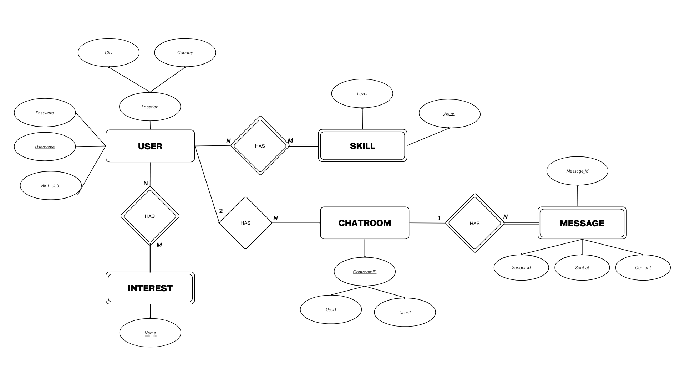
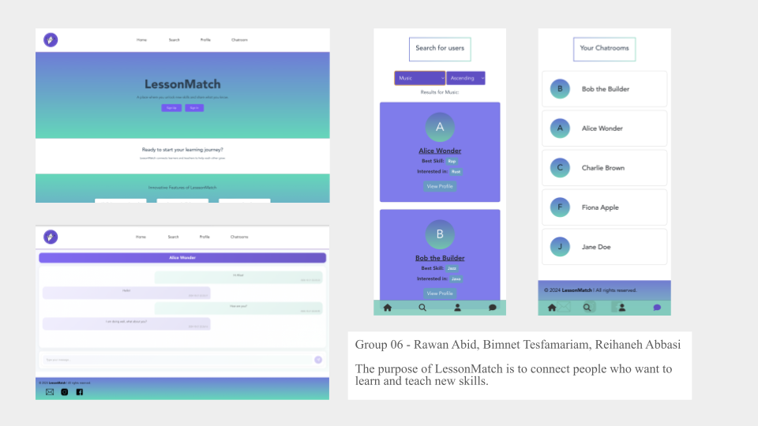

# Backend and Frontend Template

Latest version: https://git.chalmers.se/courses/dit342/group-00-web

This template refers to itself as `group-00-web`. In your project, use your group number in place of `00`.

## Project Structure

| File        | Purpose           | What you do?  |
| ------------- | ------------- | ----- |
| `server/` | Backend server code | All your server code |
| [server/README.md](server/README.md) | Everything about the server | **READ ME** carefully! |
| `client/` | Frontend client code | All your client code |
| [client/README.md](client/README.md) | Everything about the client | **READ ME** carefully! |
| [docs/LOCAL_DEPLOYMENT.md](docs/LOCAL_DEPLOYMENT.md) | Local production deployment | Deploy your app local in production mode |

## Requirements

The version numbers in brackets indicate the tested versions but feel free to use more recent versions.
You can also use alternative tools if you know how to configure them (e.g., Firefox instead of Chrome).

* [Git](https://git-scm.com/) (v2) => [installation instructions](https://www.atlassian.com/git/tutorials/install-git)
  * [Add your Git username and set your email](https://docs.gitlab.com/ce/gitlab-basics/start-using-git.html#add-your-git-username-and-set-your-email)
    * `git config --global user.name "YOUR_USERNAME"` => check `git config --global user.name`
    * `git config --global user.email "email@example.com"` => check `git config --global user.email`
  * > **Windows users**: We recommend to use the [Git Bash](https://www.atlassian.com/git/tutorials/git-bash) shell from your Git installation or the Bash shell from the [Windows Subsystem for Linux](https://docs.microsoft.com/en-us/windows/wsl/install-win10) to run all shell commands for this project.
* [Chalmers GitLab](https://git.chalmers.se/) => Login with your **Chalmers CID** choosing "Sign in with" **Chalmers Login**. (contact [support@chalmers.se](mailto:support@chalmers.se) if you don't have one)
  * DIT342 course group: https://git.chalmers.se/courses/dit342
  * [Setup SSH key with Gitlab](https://docs.gitlab.com/ee/ssh/)
    * Create an SSH key pair `ssh-keygen -t ed25519 -C "email@example.com"` (skip if you already have one)
    * Add your public SSH key to your Gitlab profile under https://git.chalmers.se/profile/keys
    * Make sure the email you use to commit is registered under https://git.chalmers.se/profile/emails
  * Checkout the [Backend-Frontend](https://git.chalmers.se/courses/dit342/group-00-web) template `git clone git@git.chalmers.se:courses/dit342/group-00-web.git`
* [Server Requirements](./server/README.md#Requirements)
* [Client Requirements](./client/README.md#Requirements)

## Getting started

```bash
# Clone repository
git clone git@git.chalmers.se:courses/dit342/group-00-web.git

# Change into the directory
cd group-00-web

# Setup backend
cd server && npm install
npm run dev

# Setup frontend
cd client && npm install
npm run serve
```

> Check out the detailed instructions for [backend](./server/README.md) and [frontend](./client/README.md).

## Visual Studio Code (VSCode)

Open the `server` and `client` in separate VSCode workspaces or open the combined [backend-frontend.code-workspace](./backend-frontend.code-workspace). Otherwise, workspace-specific settings don't work properly.

## System Definition (MS0)

### Purpose

LessonMatch is a platform designed to connect people who want to learn and teach new skills. Users create profiles where they list what they can teach and what they want to learn, and the app matches them with others who have complementary skills. The goal is to create a community where people can easily share knowledge and help each other grow.

### Pages

**All** pages will have a menu bar at the top of the page, where users can navigate to most of the other pages on the website. The menu will always be at the top of the user’s screen, meaning it will follow the user if they scroll up/down.

**All** pages will also have a footer at the bottom of the page to display links, trademarks, etc.

* **Home**: This is the landing page, which will contain information about what LessonMatch is, and how it can benefit users to learn something new. In addition to the menu bar, there will also be buttons for users to sign in, sign up, and navigate to the ‘Find match’ page.


* **About Us**: Contains information about the website, where the initial idea came from and why it was created. Here the user can read about the developers and how they managed to come up with the idea of LessonMatch.


* **Create Account**: The page displays multiple input boxes where the user can fill in their personal information to create an account. At the end the user can finalize the creation by agreeing to terms and clicking a button that says “create account”. 


* **Sign in**: This page will contain and display a sign-in form for existing users to sign into their accounts. The sign-in form will ask for a username/email as the identifier, and a password. There will also be a ‘remember me’ button for users to tick in if they don’t want to sign in every time they open the website.


* **Profile**: The page displays the user’s profile and personal information such as name, age, current skills, progress, etc. Here the user can edit their information and get an overview of their skills and what other users see when they view their profile. 


* **Find Match**: The page will display other user-profiles and their main skills that they are willing to give a lesson on. Here the user can “match” with other users based on their skills and give lessons to each other on their respective skills.

### Entity-Relationship (ER) Diagram



## Teaser (MS3)


