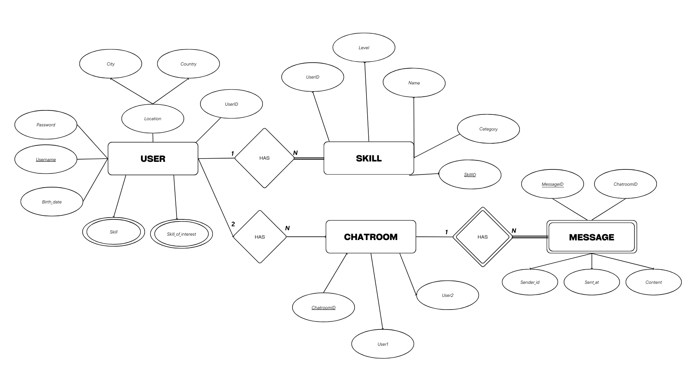

# LessonMatch

A platform that connects people who want to learn and teach new skills through peer-to-peer knowledge exchange.

## Overview

LessonMatch facilitates skill sharing by connecting users who want to learn with those who can teach. Users create profiles listing their teachable skills and learning interests, then connect with others who have complementary skill sets. The platform features real-time chat functionality to enable seamless communication between learners and teachers.

## Features

### Core Functionality
- User profile creation and management
- Skill listing (both teachable and desired)
- User search based on skills
- Real-time chat system
- Secure authentication (sign up/sign in)

### Real-Time Chat System
- Dedicated chatroom overview page for managing multiple conversations
- Chronological message history
- Instant message delivery using WebSocket technology
- Profile integration within chat interface
- Paginated message loading for optimal performance

## Pages

### Home
- Platform introduction and benefits
- Quick access to sign up/sign in
- Direct navigation to user search

### Search
- Browse user profiles
- View teaching offerings
- Initiate conversations
- Filter and search capabilities

### Profile
- Personal information display
- Skill management (teaching/learning)
- Profile customization options
- Public profile view

### Chatrooms
- Real-time messaging interface
- Active conversation management
- Direct access to user profiles
- Message history

### Authentication
- Secure sign up process
- User-friendly sign in
- Password protection
- Terms of service integration

## Technical Implementation

### Frontend
- Responsive design
- Real-time updates
- User-friendly interface
- Profile integration within chat

### Backend
- WebSocket implementation using Socket.IO
- Secure message storage and retrieval
- Pagination support for large chat histories
- User authentication and authorization

## Navigation

The platform features a consistent navigation bar across all pages, providing easy access to:
- Home
- Search
- Profile
- Chatrooms
- Authentication options

A footer is present on all pages containing:
- Important links
- Trademark information
- Legal documentation
- Contact information

### Entity-Relationship (ER) Diagram

## Teaser (MS3)

